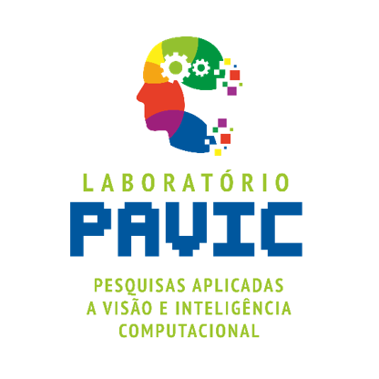

---
format:
  revealjs:
    theme: [default, custom.scss] 
    logo: "https://www.infoescola.com/wp-content/uploads/2016/05/ufpi.png"
    footer: "Mestrado em Ciência da Computação"
    incremental: true 
    preview-links: auto
    slide-number: true

---

# {background-image="images/Template Slides PAVIC.png" vertical-align="center" text-align="center" style="color: white;"}

<h4 style="color: white;"> "Não sei, só sei que foi assim” - XAI</h4>
<h4 style="color: white;"> Universidade Federal do Piauí (UFPI) </h4>
<h4 style="color: white;"> Centro de Tecnologia (CT)</h4>
<h4 style="color: white;"> Programa de Pós-Graduação em Ciência da Computação (PPGCC) </h4>
<h4 style="color: white;"> Orientador: Prof. Dr. Ricardo de Andrade Lira Rabêlo </h4>

{.absolute top=600 left=400 width="200"}
{.absolute top=600 left=1200 width="400"}

##  {background-image="images/Template Slides PAVIC 2.jpg"  background-position="top center"}
### Resumo Ilustrativo

teste de exemplo de texto para o resumo ilustrativo. Este resumo deve ser breve e destacar os principais pontos da pesquisa, incluindo a motivação, a abordagem proposta e os resultados esperados.

- teste 
- testando o tamanho da fonte
- teste de quebra de linha  

##  {background-image="images/Template Slides PAVIC 2.jpg"  background-position="top center"}
### Definição do Problema

##  {background-image="images/Template Slides PAVIC 2.jpg"  background-position="top center"}
### Visão Geral da Proposta (Abordagem Proposta, etc.);

##  {background-image="images/Template Slides PAVIC 2.jpg"  background-position="top center"}
### Estado/Continuidade da Pesquisa

##  {background-image="images/Template Slides PAVIC 2.jpg"  background-position="top center"}
### Cronograma

##  {background-image="images/Template Slides PAVIC 2.jpg"  background-position="top center"}
### Observações Gerais.

# {background-image="images/Template Slides PAVIC.png" vertical-align="center" text-align="center" style="color: white;"}

<h4 style="color: white;"> Não sei, só sei que foi assim” - XAI</h4>
<h1 style="color: white;"> Obrigado!</h1>
<h4 style="color: white;"> Universidade Federal do Piauí (UFPI) </h4>
<h4 style="color: white;"> Centro de Tecnologia (CT)</h4>
<h4 style="color: white;"> Programa de Pós-Graduação em Ciência da Computação (PPGCC) </h4>
<h4 style="color: white;"> Orientador: Prof. Dr. Ricardo de Andrade Lira Rabêlo </h4>

{.absolute top=600 left=400 width="200"}
{.absolute top=600 left=1200 width="400"}